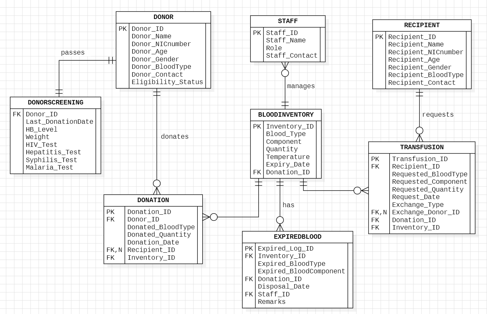

# 🩸 Blood Bank Management System

A database-driven **Blood Bank Management System** developed as part of our Database Systems course project. Built with a Python-based graphical interface and Oracle SQL as the backend, the system handles all core blood bank operations from donor registration to blood inventory tracking with secure, role-based access control.

---

## About the Project

This system is designed to digitize and streamline the operations of a hospital blood bank. It manages:

- Donor profiles, donation history, and medical records
- Recipient data and transfusion history
- Blood inventory including expired blood units
- Staff accounts with controlled system access

Access to the system is role-restricted to maintain data security and integrity:

| Role | Access Level |
|------|-------------|
| **Admin** | Full access — can add, update, and delete all records (password protected) |
| **Staff** | Restricted — can add and view medical records only |
| **Donor / Recipient** | View-only — can see personal records by entering their ID |

---

## Entity Relationship Diagram

---

## ✨ Key Features

- **Role-Based Authentication** — Each user type logs in with credentials suited to their access level
- **Complete CRUD Operations** — Add, update, and delete donors, recipients, and inventory entries
- **Blood Inventory Tracking** — Monitors available and expired blood units in real time
- **Automated Daily Reports** — Generates inventory and transaction summaries automatically
- **Database Triggers** — Enforces business rules automatically on data insertion and updates
- **Stored Procedures** — Pre-built procedures for frequently performed operations boost efficiency
- **Clean GUI** — Simple, easy-to-navigate Tkinter interface for non-technical users

---

##  Technologies Used

| Layer | Technology |
|-------|-----------|
| User Interface | Python — Tkinter |
| Database | Oracle SQL |
| DB Features | Triggers, Stored Procedures, Constraints |

---

## Setup & Installation

1. **Clone the repository**
2. **Install Python dependencies**
3. **Set up the Oracle Database**
4. **Configure the database connection**
5. **Launch the application**

---

## 🔮 Future Scope

- **Low Stock Alerts** — Automated notifications when blood units fall below a threshold
- **Web Version** — Browser-accessible interface for remote hospital use
- **Visual Analytics** — Graphical dashboards for inventory and donation trends

---

## 🤝 Contributing

This project was built collaboratively as a semester project for our **Database Systems** course. We welcome suggestions, bug reports, and contributions. Feel free to open an issue or submit a pull request!

---

## 👥 Authors

Developed by a team of 2 as part of the Database Systems course.
